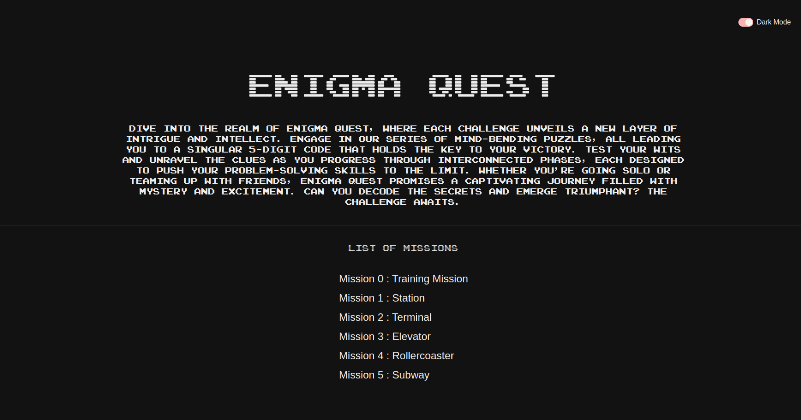

<br/>
<p align="center">
  <a href="https://github.com/Kiana8181/Enigma-Quest">
    
  </a>

  <h1 align="center">Enigma Quest</h1>

  <p align="center">
    Welcome to **Enigma Quest**, an immersive and challenging puzzle-solving game where you navigate through a series of interconnected puzzles to unlock a 5-digit code. Test your problem-solving skills and intellect as you progress through each step of our meticulously designed games.
    <br/>
    <br/>
    <a href="https://kiana8181.github.io/Enigma-Quest/">View Demo</a>
    .
  </p>
</p>

## Table of Contents

- [About the Project](#about-the-project)
- [How to Play](#how-to-play)
- [Live Demo](#live-demo)
- [Installation](#installation)

## About The Project



**Enigma Quest** is an immersive and challenging puzzle-solving game designed to test your problem-solving skills and intellect. The project consists of a series of interconnected puzzles, each leading to a 5-digit code that players must unlock to progress. Here's an overview of what the project includes:

- **Welcome Page**: An engaging introduction to the game.
- **Game List**: Six unique games, each with its own set of puzzles.
- **Multi-step Puzzles**: Each game comprises 3 to 5 steps, each presenting a unique puzzle.
- **Countdown Timer**: A timer that adds urgency, showing the remaining time to complete each game.
- **Step-by-Step Progression**: Players must solve each step correctly to move on to the next.
- **Feedback on Answers**: Immediate feedback is given for each input, highlighting correct digits in green and incorrect ones in red.
- **Winning and Losing Conditions**: Players win by completing all steps within the time limit; if the time runs out, they lose.

This project was created using [Vite](https://vitejs.dev/), a fast and modern build tool optimized for development. The design focuses on user engagement, interactivity, and a rewarding puzzle-solving experience.

## How to Play

1. **Welcome Page**: Start your adventure by entering the welcome page.
2. **Select a Game**: Choose from six available games, each offering a unique set of puzzles.
3. **Solve Puzzles**: Each game consists of 3 to 5 steps. Enter your answer in the input box and submit.
4. **Get Feedback**: Upon submission, correct digits will be highlighted in green and incorrect ones in red.
5. **Progress**: Correct answers unlock the next step. Continue solving until you complete all steps.
6. **Beat the Clock**: Keep an eye on the countdown timer. Complete all steps within the time limit to win the game.

## Live Demo

Try out Enigma Quest [here](https://kiana8181.github.io/Enigma-Quest/).

## Installation

To set up Enigma Quest locally, follow these steps:

1. **Clone the Repository**:
   ```bash
   git clone https://github.com/Kiana8181/Enigma-Quest.git
   cd enigma-quest
   ```
   
2. Install Dependencies:
   ```bash
   npm install
   ```

3. Run the Development Server:
   ```bash
   npm run dev
   ```
   
4. Build for Production:
    ```bash
   npm run build
   ```
  
5. Preview the Build:
   ```bash
   npm run preview
   ```
